## Lab 6
Maria Rochford

**Part 1**

Reproducing the maps.

The original data and the weights manager
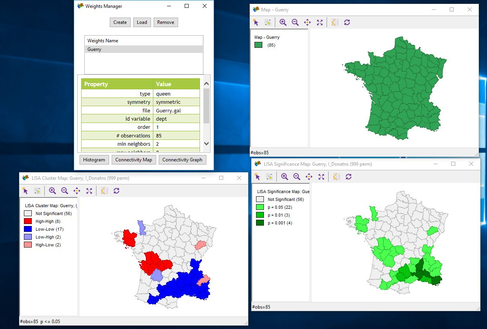

Changing the permutations to 99999
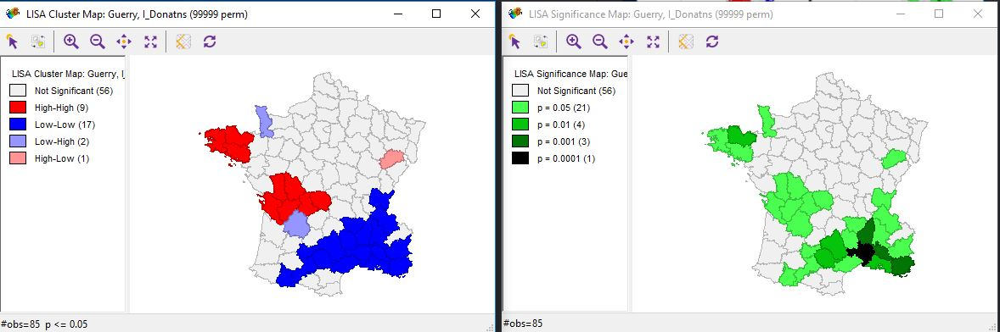

We then clicked on the high high and low low to visualize the outliers.

Using the significance filter. Above the significance was p <0.05 >
Here it is p<0.01 >
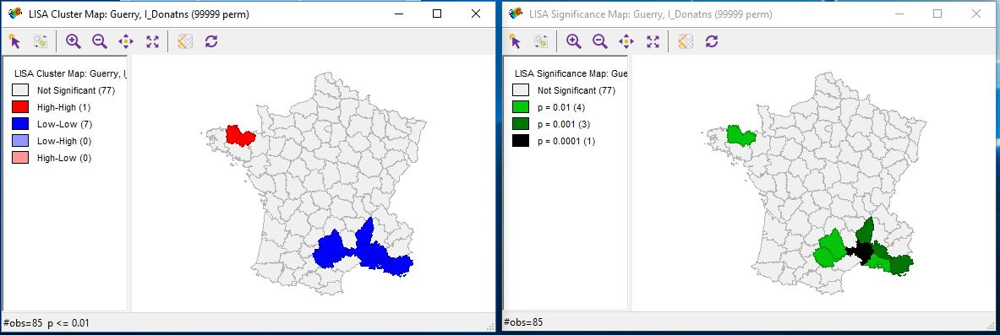

Next action is to check the Bonferroni and the False Discovery Rate.

Here we have the cores of a cluster and their neighbors
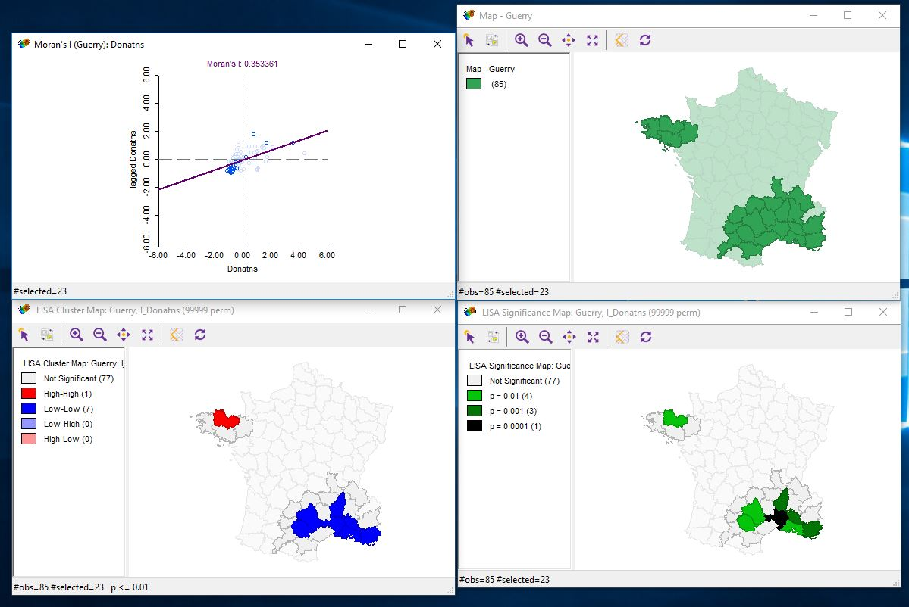

Now here are the Univariate Local Geary Cluster Maps
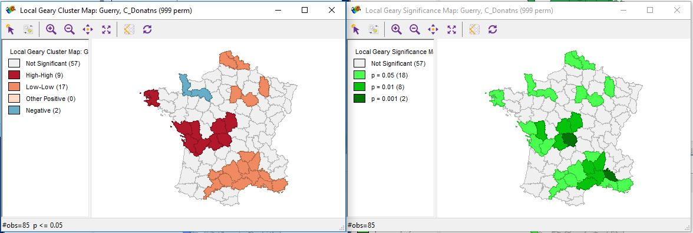

Interpretation of Spatial Autocorrelation

High-High:
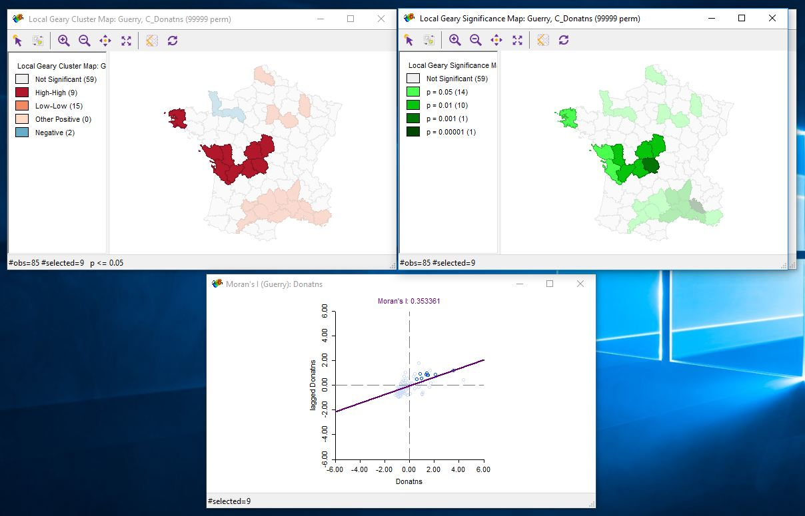

Low-Low:
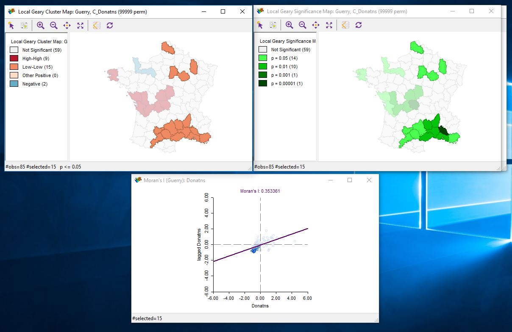

Negative:
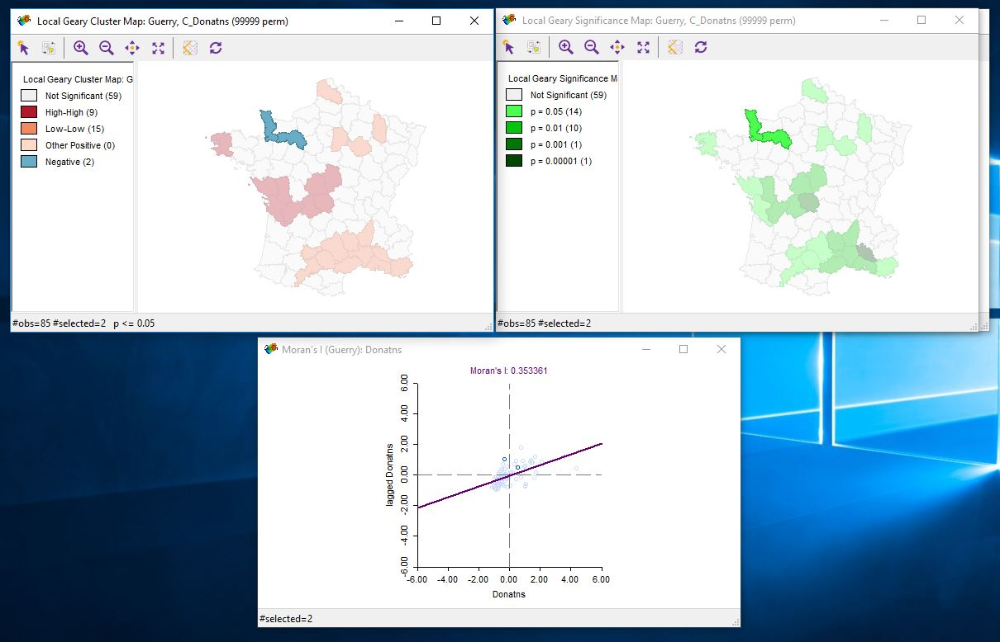

Implementation of Local Getis-Ord statistics
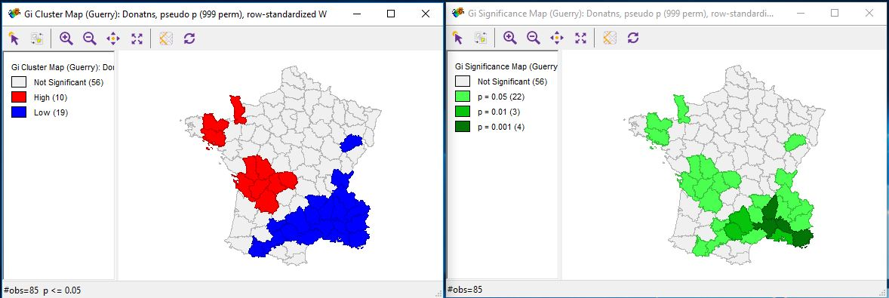

Implementation of the Getis-Ord statistics with significance filter.
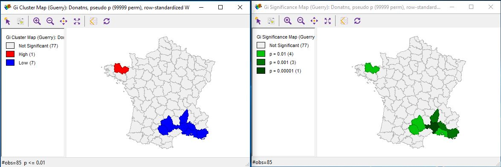

**Part 2**

Using the Demographics fileset from the Vital Sign 2016, I chose to do an analysis on the Median Household Income and household size.

My first step was to run a Moran's I to find the correlation between average household size and the median household income.

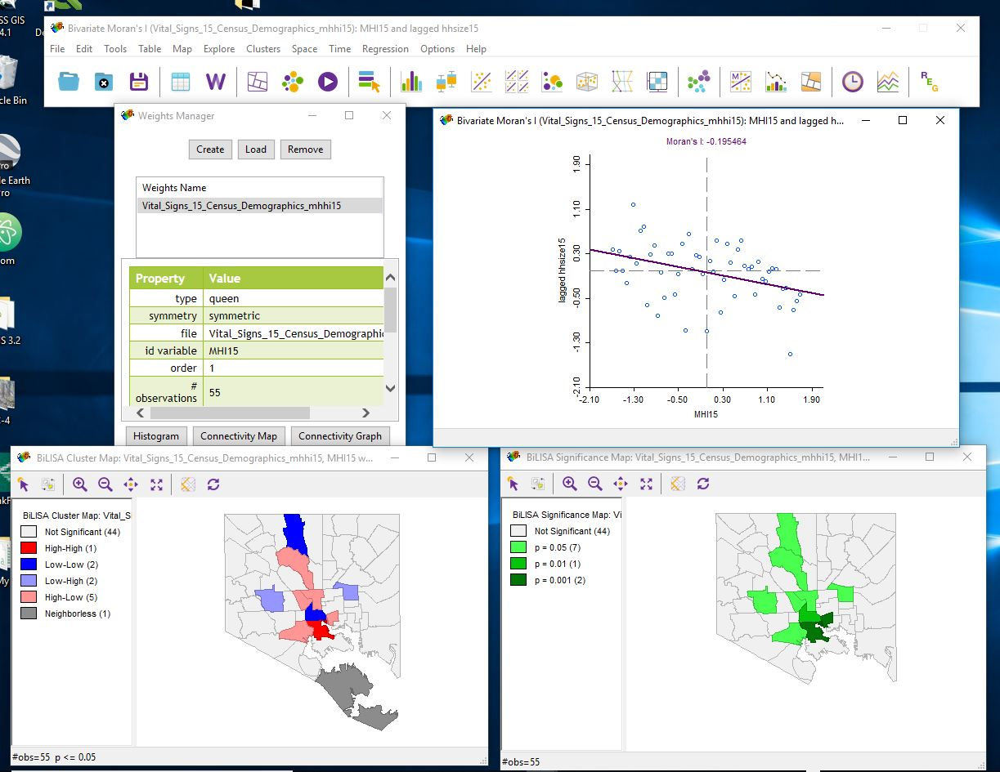

This is negatively correlated. It is saying that the higher the Median Household Income is, the smaller the household size is. This makes sense because if a family doesn't have children than they have more time to work and more money.

**Part 3**

Now I am going to run a regression model comparing the same variables as before (Median Household Income and Household size).

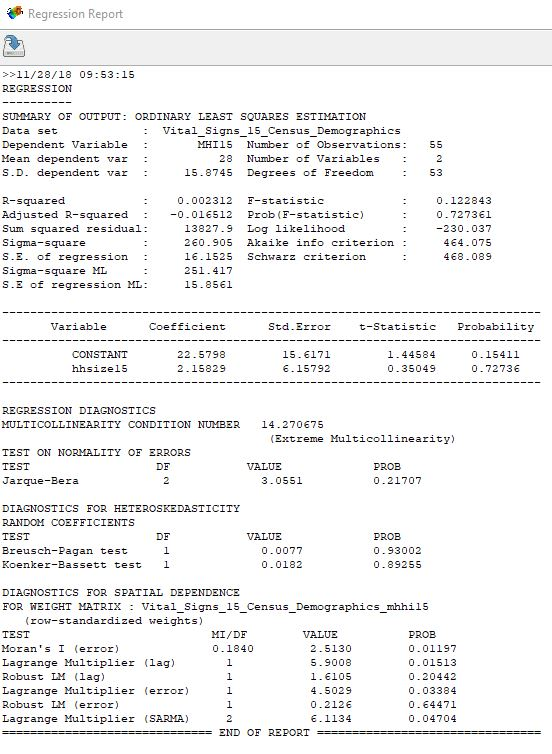

Both the Lag and Error tests are significant so that means that I need to look at the Robust LM lag and error. I need to run a lag test because the significance is higher.

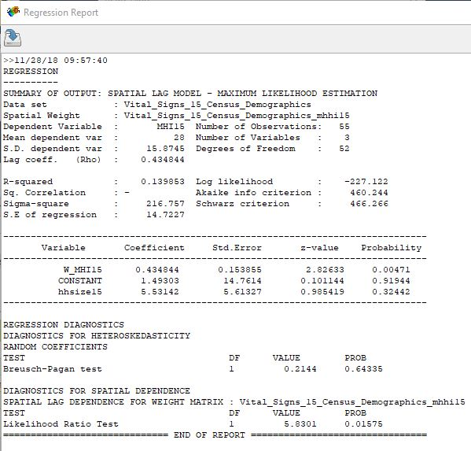

This result means that household size is not statistically significant. There are alot of other factors to consider in the relationship between household income and size. 
