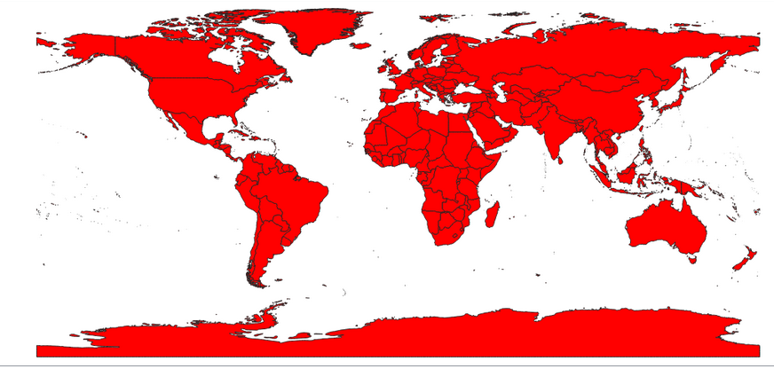

<!--This is the first row of projects -->

### Lab 5

[See more details here.](https://github.com/Maria37/maria37.github.io/blob/master/Lab_5/Lab_5.md)

Lab 5 of GES 486. Learning Python! 

<small>__Tools__: QGIS, R

### Lab 6

[See more details here.](https://github.com/Maria37/maria37.github.io/blob/master/Lab_6/Lab6.md)

<small>__Tools__: QGIS, R</small>

<!--This is the second row of projects -->

  

### Project 2 

[See more details here.](https://github.com/Maria37/maria37.github.io/blob/master/Project_2/project2.md)

This is my project.

<small>__Tools__: QGIS, Interpolation, Photoshop</small>

### Final Project 

[See more details here.]()

COMING SOON

<small>__Tools__: QGIS, Interpolation, Photoshop

