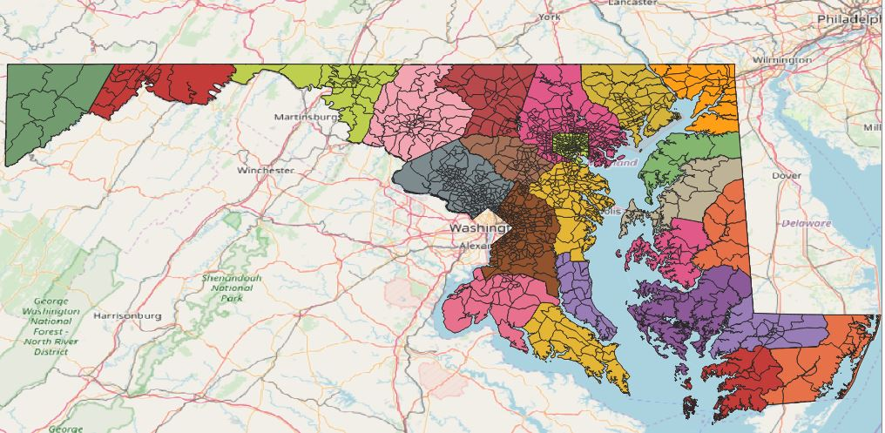
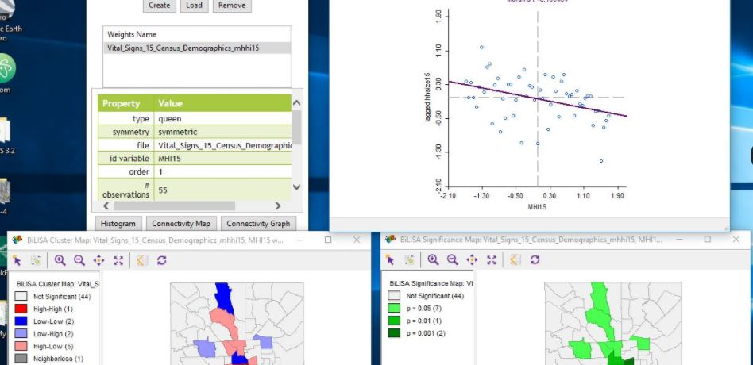
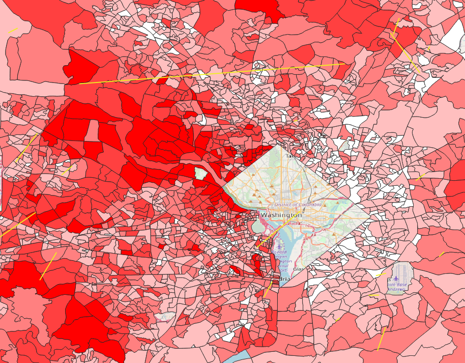

<!--This is the first row of projects -->

### Project 2 

[See more details here.](https://github.com/Maria37/maria37.github.io/blob/master/Project_2/project2.md)

This is my project.

<small>__Tools__: QGIS, Interpolation, Photoshop</small>

### Lab 6

[See more details here.](https://github.com/Maria37/maria37.github.io/blob/master/Lab_6/Lab6.md)

<small>__Tools__: QGIS, R</small>

<!--This is the second row of projects -->

### Final Project 

[See more details here.]()

COMING SOON

<small>__Tools__: QGIS, Interpolation, Photoshop

### Project 4

[See more details here.](https://dillonma.github.io/project2_sfi/project2.html)

Phasellus consequat quam elit, et iaculis risus pellentesque aliquet. Proin ut enim dui. Ut elementum, purus nec rhoncus sagittis, nibh nunc auctor nulla, eu condimentum nisi velit eget magna. Nulla feugiat tincidunt dictum. Vestibulum congue sapien elit. Maecenas non sodales ligula, quis tempor mi. 

<small>__Tools__: QGIS, R

<small>__Data__:
[Census Streets](https://www.census.gov/cgi-bin/geo/shapefiles/index.php), US Business Directory (defunct)</small>

